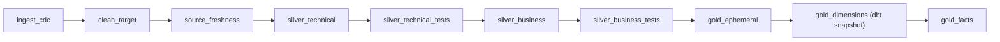

#  Walmart Lakehouse — Agentic Data Engineering Pipeline

> An end-to-end, runnable **Lakehouse + Agentic Data Engineering** pipeline for simulated Walmart retail data — CDC ingestion, a metadata-driven Silver OBT, SCD Type 2 Gold dimensions, and full Airflow + Docker orchestration.

<p align="left">
  
  
  
  
  
</p>

Reference project: [`anshlambagit/Walmart_Airflow_DBT_Project`](https://github.com/anshlambagit/Walmart_Airflow_DBT_Project). 

---

##  Table of Contents

- [Architecture](#-architecture)
- [What's Actually Runnable Here](#-whats-actually-runnable-here)
- [Project Structure](#-project-structure)
- [Getting Started](#-getting-started)
- [The Metadata-Driven OBT (the interesting part)](#-the-metadata-driven-obt-the-interesting-part)
- [SCD Type 2 Dimensions](#-scd-type-2-dimensions)
- [Agentic Ad-hoc Querying (MCP)](#-agentic-ad-hoc-querying-mcp)
- [Pipeline DAG](#-pipeline-dag)
- [Going to Production](#-going-to-production)
- [License](#-license)

---

##  Architecture

```
┌──────────────────────────────────────────────────────────────────────────┐
│ 1. DATA SOURCES & AGENTIC DATABASE LAYER                                 │
│    • AWS S3 (data lake: review CSVs)                                     │
│    • Ghost Postgres DB (customers, stores, products, employees, orders)  │
│    • VS Code + MCP + Claude/Copilot (agentic ad-hoc queries)             │
│    • Forking mechanism (production vs. sandbox DB fork)                  │
└───────────────────────────────────┬──────────────────────────────────────┘
                                     ▼
┌──────────────────────────────────────────────────────────────────────────┐
│ 2. INGESTION & BRONZE LAYER (Databricks + Delta Lake)                    │
│    • Unity Catalog `Walmart` → schema `bronze`                           │
│    • Cursor-based CDC (`updated_at` + PKs), idempotent upserts           │
└───────────────────────────────────┬──────────────────────────────────────┘
                                     ▼
┌──────────────────────────────────────────────────────────────────────────┐
│ 3. SILVER LAYER (dbt)                                                    │
│    • silver_t — cleaned, tested, incremental staging models              │
│    • silver_b — dynamic Jinja-driven One Big Table (OBT)                 │
└───────────────────────────────────┬──────────────────────────────────────┘
                                     ▼
┌──────────────────────────────────────────────────────────────────────────┐
│ 4. GOLD LAYER (dbt)                                                      │
│    • eph_* ephemeral CTE staging                                         │
│    • dbt snapshot → SCD Type 2 dims (customers, products, stores, …)     │
│    • fact_orders — additive order-line measures                         │
└───────────────────────────────────┬──────────────────────────────────────┘
                                     ▼
┌──────────────────────────────────────────────────────────────────────────┐
│ 5. ORCHESTRATION (Apache Airflow + Docker)                               │
│    orchestrate.py: ingest_cdc → clean → freshness → silver_t → silver_b  │
│    → gold_ephemeral → gold_dimensions (snapshot) → gold_facts            │
└──────────────────────────────────────────────────────────────────────────┘
```


##  Project Structure

```
Walmart_Airflow_DBT_Project/
├── README.md
├── airflow_dbt_project/
│   ├── dags/
│   │   └── orchestrate.py            # Master DAG — full ingest→silver→gold graph
│   ├── docker/
│   │   └── Dockerfile                # Custom Airflow image (dbt + databricks-sdk)
│   ├── docker-compose.yml            # Airflow + local "Ghost" Postgres source
│   ├── requirements.txt
│   ├── .env.example
│   ├── ingestion/
│   │   ├── cdc_loader.py             # Cursor-based CDC extract + upsert
│   │   └── db_fork.py                # Production→sandbox DB forking guardrail
│   ├── mcp/
│   │   └── mcp_config.json           # Agentic (MCP) server config
│   ├── seed/
│   │   ├── 01_schema.sql             # Source Postgres DDL
│   │   └── 02_load_csv.sql           # Loads walmart_dataset/ CSVs on first boot
│   └── dbt_project/
│       ├── dbt_project.yml           # incl. live `obt_config` metadata dictionary
│       ├── profiles.yml.example
│       ├── packages.yml
│       ├── macros/
│       │   └── generate_obt.sql      # The dynamic Jinja join-graph engine
│       ├── models/
│       │   ├── sources.yml           # Bronze source + freshness config
│       │   ├── silver_t/             # stg_customers, stg_orders, ... + tests
│       │   ├── silver_b/             # obt.sql + obt_config.yml (docs)
│       │   └── gold/                 # eph_*, fact_orders + tests
│       └── snapshots/                # dim_customers, dim_products, ... (SCD2)
└── walmart_dataset/
    ├── customers.csv
    ├── stores.csv
    ├── products.csv
    ├── employees.csv
    ├── orders.csv
    ├── order_items.csv
    └── reviews.csv                   # simulates the S3 review feed
```

---


##  Agentic Ad-hoc Querying (MCP)

`mcp/mcp_config.json` wires up two MCP servers:

- **`walmart_postgres_sandbox`** — points at the **forked** sandbox database only, never production
- **`walmart_databricks`** — ad-hoc SQL against Unity Catalog (`bronze`/`silver_t`/`silver_b`/`gold`)

Load this config into VS Code's MCP settings (or Claude Desktop) to query your data in plain English. Run `python ingestion/db_fork.py create` before each exploration session to refresh the sandbox from production.

---

##  Pipeline DAG



---

##  Going to Production

1. Fill in `DATABRICKS_*` and `AWS_*` vars in `.env` and `profiles.yml`.
2. Replace the stub comments in `ingestion/cdc_loader.py`'s `get_last_cursor()` and `upsert_to_bronze()` with real Delta Lake reads/`MERGE` calls (Databricks notebook or job context).
3. Set `DATABRICKS_INGEST_JOB_ID` to the Databricks Job that runs `cdc_loader.run()`.
4. Configure an S3 external location + Auto Loader stream for `reviews.csv`-style data landing in Gold.
5. Swap `source_db` for your real operational Postgres, keeping the same cursor/PK conventions in `ingestion/cdc_loader.py::TABLES`.

---

## 📄 License

Distributed under the MIT License.
